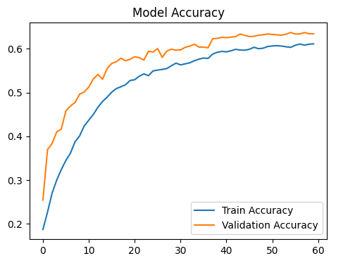
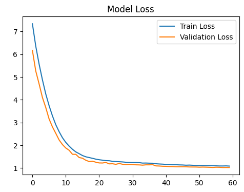

<div align="center">


[](https://twitter.com/intent/follow?screen_name=DeriaRanit)
[](https://www.linkedin.com/in/ranit-deria-916864257/)

  <br />
   <!-- Replace with your actual logo path if available, or remove -->
   <div align="center">
  
</div>
  <br />

  <h2 align="center">Mood Based Music Recommendation</h2>

  <p align="center">
  MoodMate is an intelligent emotional companion that detects your mood from a selfie, curates personalized music playlists, and connects you with a supportive community. Built with <strong>Next.js 16</strong>, <strong>React 19</strong>, and <strong>Supabase</strong>, and powered by a <strong>Flask AI Backend</strong>, it features a bold <strong>pop brutalist aesthetic</strong> and practical tools for your daily emotional well-being.
  </p>

  <a href="https://moodmate-seven.vercel.app/"><strong>➥ Live Demo</strong></a>

  <br />

  

</div>

## Table of Contents

- [Overview](#overview)
- [Prerequisites](#prerequisites)
- [Technologies Utilized](#technologies-utilized)
- [Datasets & Model Training](#datasets-model-training)
- [Features](#features)
- [Run Locally](#run-locally)
- [Deployment](#deployment)
- [Configuration](#configuration)
- [Project Structure](#project-structure)
- [Model Training & Evaluation](#model-training-evaluation)
- [Privacy & Safety](#privacy--safety)
- [License](#license)
- [Acknowledgements](#acknowledgements)
- [Connect](#connect)

## Overview

Emotional wellbeing shouldn't be complicated or isolating. **MoodMate** elevates your daily mood with three core pillars:

- **Detection:** Instantly analyze your emotional state from a single selfie using advanced AI.
- **Curation:** Receive personalized music playlists tailored to resonate with or uplift your current vibe.
- **Connection:** Share your mood card with a supportive community to find others on the same wavelength.

All wrapped in a high-contrast, partially accessible, and mobile-responsive **Pop Brutalist UI**.

## Prerequisites: <a name="prerequisites"></a>

Before setting up MoodMate, ensure you have:

-  **Git** (Version control)
-  **Node.js** (v18.x or later)
-  **npm** or **pnpm** (Package manager)
-  **Python** (v3.9 or later)
-  **Supabase** (Account & Project)
-  **Docker** (Optional - for containerized backend)

## Technologies Utilized: <a name="technologies-utilized"></a>

- **Framework:**  Next.js 16 (App Router)
- **Language:**  TypeScript &  Python
- **Database & Auth:**  Supabase
- **AI Backend:**  Flask
- **Machine Learning:**  TensorFlow &  OpenCV
- **Data Processing:**  Pandas &  NumPy
- **Styling:**  Tailwind CSS
- **Deployment:**  Docker & Hugging Face Spaces
- **Icons:**  Lucide React

## Datasets & Model Training <a name="datasets-model-training"></a>

MoodMate’s core intelligence is powered by a custom **VGG-style Convolutional Neural Network (CNN)**, trained on industry-standard datasets and optimized via a robust preprocessing pipeline to ensure real-time accuracy.

### 📁 Datasets Used

- **FER-2013 (Facial Expression Recognition)**
  - **Source:** [FER-2013 (Kaggle)](https://www.kaggle.com/datasets/msambare/fer2013)
  - **Scale:** ~35,000 grayscale facial images (48×48 pixel resolution).
  - **Classes:** 7 distinct emotions (*Happy, Sad, Angry, Fear, Surprise, Disgust, Neutral*).
  - **Usage:** Serves as the primary training ground for the deep learning model, pre-processed into `.npy` binary files for efficient memory loading.

- **Spotify Tracks Dataset**
  - **Source:** [Spotify Tracks Dataset - (Kaggle)](https://www.kaggle.com/datasets/maharshipandya/-spotify-tracks-dataset)
  - **Features:** Rich audio attributes including *valence, energy, danceability,* and *track_genre*.
  - **Usage:** Powers the recommendation engine by mapping detected emotion labels to sonically aligned music genres and attributes (e.g., High *Valence* + High *Energy* = "Happy").

### 🔬 Preprocessing & Training Pipeline

To overcome overfitting and ensure the model works in varied lighting conditions, the following engineering strategies were implemented:

- **Image Standardization:**
  - Conversion to single-channel Grayscale.
  - Pixel normalization (scaling `0-255` values to `0-1` range).
  - Resizing to strict `48x48` input dimensions.

- **Real-Time Data Augmentation:**
  - Implemented `ImageDataGenerator` to artificially expand the training set.
  - **Techniques:** Rotation (`±15°`), Zoom (`10%`), Width/Height Shifts (`10%`), and Horizontal Flips to force the model to learn structural features rather than memorizing pixels.

- **Regularization Strategy:**
  - **L2 Kernel Regularization** (`0.01`) applied to dense layers.
  - **Dropout layers** (increased to `0.6`) to prevent neuron co-dependency.
  - **Callbacks:** Utilized *EarlyStopping* and *ReduceLROnPlateau* to dynamically optimize the learning rate during training.

## Features: <a name="features"></a>

- **AI Mood Scanner:** Analyze your emotions from a selfie using computer vision.
- **Vibe Curation:** Get instant, mood-matched music recommendations.
- **Community Pulse:** Share your "vibe cards" and connect with others feeling similarly.
- **Secure Identity:** Seamless authentication via Supabase.
- **Pop Brutalist Design:** A bold, high-contrast interface for a unique user experience.
- **Emotional Safety:** Crisis resource integration for detected distress signals.
- **Responsive & Fluid:** Optimized for all devices with smooth animations.

## Run Locally: <a name="run-locally"></a>

1. **Clone the Repository:**

   ```bash
   git clone https://github.com/RanitDERIA/moodmate.git
   cd moodmate
   ```

2. **Backend Setup:**

   Open a terminal and navigate to the backend directory:

   ```bash
   cd backend
   pip install -r requirements.txt
   python app.py
   ```
   
   The Flask server will start on `http://localhost:5000`.

3. **Frontend Setup:**

   Open a new terminal in the project root:

   ```bash
   npm install
   # or
   pnpm install
   ```

4. **Environment Configuration:**

   Create a `.env.local` file in the root directory:

   ```env
   NEXT_PUBLIC_SUPABASE_URL=your_supabase_url
   NEXT_PUBLIC_SUPABASE_ANON_KEY=your_supabase_anon_key
   ```

5. **Start Application:**

   ```bash
   npm run dev
   ```

   Visit `http://localhost:3000` to begin your journey.

## Deployment: <a name="deployment"></a>

MoodMate follows a distributed deployment strategy:

1. **Frontend:** Deployed on **Vercel** for optimal performance and edge capabilities.
2. **Backend:** AI Service hosted on **Hugging Face Spaces** (Docker/Flask).

To deploy your own instance:
1. Fork the repo.
2. Deploy the `backend` folder to Hugging Face Spaces (choose Docker SDK).
3. Import the repo to Vercel and configure the environment variables.

## Configuration: <a name="configuration"></a>

- **Environment Variables:**
  - `NEXT_PUBLIC_SUPABASE_URL`: Your Supabase Project URL.
  - `NEXT_PUBLIC_SUPABASE_ANON_KEY`: Your Supabase Anonymous Key.
  - `NEXT_PUBLIC_API_URL`: URL of your deployed Flask Backend.

- **Theme & Branding:**
  - The "Pop Brutalist" aesthetic is centrally managed in `tailwind.config.js`.
  - Primary colors and shadows can be adjusted to match your preferred vibe.

## Project Structure: <a name="project-structure"></a>

```
moodmate/
├── app/                         # Next.js App Router (frontend pages & routes)
│   ├── api/                     # Server-side API routes (Next.js)
│   │   ├── analyze-text/        # Mood analysis API (connects to ML backend)
│   │   └── metadata/            # SEO & OpenGraph metadata
│   ├── auth/callback/           # OAuth authentication callback (Supabase)
│   ├── community/               # Community playlists & social features
│   ├── home/                    # User dashboard landing
│   ├── login | signup           # Authentication pages
│   ├── profile | my-vibe        # User profile & mood history
│   ├── layout.tsx               # Global layout (Navbar, Footer, Providers)
│   ├── globals.css              # Global Tailwind styles
│   └── not-found.tsx            # Custom 404 page
│
├── backend/                     # Machine Learning backend (Python)
│   ├── app.py                   # Flask/FastAPI app serving ML predictions
│   ├── models/                  # Trained ML model (.h5)
│   ├── data/                    # Processed dataset used for training
│   ├── requirements.txt         # Python dependencies (TensorFlow, NumPy, etc.)
│   └── Dockerfile               # Containerized ML backend
│
├── components/                  # Reusable React components
│   ├── community/               # Vibe cards, comments, social sharing
│   ├── home/                    # Dashboard UI (stats, mood selector)
│   ├── layout/                  # Navbar, footer, user navigation
│   └── custom/                  # Advanced UI (webcam, grids, OAuth buttons)
│
├── lib/                         # Shared frontend utilities
│   ├── api.ts                   # API helpers (frontend ↔ backend)
│   ├── supabase.ts              # Supabase client configuration
│   ├── moods.ts                 # Mood constants & mappings
│   └── validators.ts            # Input validation schemas
│
├── supabase/                    # Database schema & migrations
│   └── migrations/              # SQL migrations (comments, likes, profiles)
│
├── public/                      # Static assets
│   ├── images/                  # Logos, mood icons, partner platforms
│   └── thumbnails/              # UI & feature preview images
│
├── middleware.ts                # Route protection & auth middleware
├── next.config.ts               # Next.js configuration
├── package.json                 # Frontend dependencies & scripts
├── tsconfig.json                # TypeScript configuration
├── README.md                    # Project documentation
└── LICENSE                      # Apache License 2.0
```

## Model Training & Evaluation <a name="model-training-evaluation"></a>

All deep learning experiments, from data preprocessing to final model selection, were conducted in a cloud-based GPU environment using  **Google Colab**  to ensure computational efficiency and reproducibility.

### 📓 Source Notebooks (Google Colab)

The complete training pipeline is documented in the following notebooks:

- **[📄 Data Preprocessing & Augmentation](https://colab.research.google.com/drive/1d3_dR6lzujHKgSvjmMvEFAWDVUE_bW6K?usp=sharing)** *Handles loading the FER-2013 dataset, converting raw pixels to standard arrays, and generating `.npy` binary files for efficient loading.*

- **[🧠 Model Training & Fine-Tuning](https://colab.research.google.com/drive/1UA0SI8UE-f_kA0XE36UQltg5YcnnRtUF?usp=sharing)** *Contains the Custom CNN architecture, Data Augmentation setup (`ImageDataGenerator`), and the full training loop with callbacks.*

> **Note:** These notebooks demonstrate the progression from raw CSV data to a finalized `.h5` model file.

### 📈 Performance Metrics

The final model achieved a stable **Validation Accuracy of ~63%** on the FER-2013 dataset, a strong baseline for a custom lightweight CNN.

#### 🔹 Key Observations
- **Overfitting Eliminated:** By implementing **Data Augmentation** (Rotation ±15°, Zoom) and **L2 Regularization**, the "Generalization Gap" between training and validation accuracy was effectively closed.
- **Robust Learning:** The validation loss curve tracks closely with training loss, confirming that the model learns structural features rather than memorizing pixel noise.
- **Dynamic Optimization:** Utilized `ReduceLROnPlateau` to fine-tune weights whenever learning stalled, ensuring convergence.

<table align="center">
  <tr>
    <td align="center" width="50%">
      
      <br />
      <sub><i>Convergent training and validation accuracy demonstrates effective feature learning with controlled generalization.</i></sub>
    </td>
    <td align="center" width="50%">
      
      <br />
      <sub><i>Monotonic loss reduction across epochs confirms stable optimization and absence of training instability.</i></sub>
    </td>
  </tr>
</table>


### 🧪 Final Inference Model

- **Architecture:** Custom VGG-style CNN (Lightweight, optimized for web deployment).
- **Export Format:** `moodmate_final_model.h5` (Keras/TensorFlow).
- **Inference Strategy:** The model is loaded globally in the Flask backend to ensure **<200ms latency** per prediction.

## Privacy & Safety: <a name="privacy--safety"></a>

- **Ephemeral Processing:** User photos are processed in-memory for mood detection and immediately discarded. No images are ever stored on our servers.
- **Data Security:** Personal data and curated vibes are secured via Supabase's Row Level Security (RLS) policies.
- **Emotional Well-being:** If signs of distress are detected, MoodMate automatically provides links to verified crisis hotlines and mental health resources.

## License: <a name="license"></a>

This project is licensed under the **Apache License 2.0**.
<sub>

- Free to use, modify, and distribute (including commercial use)  
- Redistributions must include proper attribution and the license copy  
- Modified files must clearly indicate changes  
- Provided **AS IS**, without warranties or liability  
</sub>

## Acknowledgements: <a name="acknowledgements"></a>

I would like to express my sincere gratitude to my mentor, for their invaluable guidance, continuous support, and constructive feedback throughout the development of **MoodMate**. Their insights played a pivotal role in refining the machine learning pipeline and shaping the final architecture of this project.

I also extend my thanks to **Infosys Springboard** for providing the platform, resources, and internship opportunity that allowed me to explore advanced AI/ML concepts and apply them in a real-world scenario.

<p align="center">
  
  <br>
  <i>Virtual Internship 6.0</i>
</p>

## Let's Connect <a name="connect"></a>

<p align="left">
  <a href="mailto:bytebardderia@gmail.com">
    
  </a>
  <a href="https://www.linkedin.com/in/ranit-deria-916864257/">
    
  </a>
  <a href="https://twitter.com/DeriaRanit">
    
  </a>
  <a href="https://github.com/RanitDERIA">
    
  </a>
</p>

---
<div align="center">

**⭐ Star this repository if you enjoyed your vibe check!**

Made with ❤️ and 🎵 by [Ranit Deria](https://profession-folio.vercel.app)

</div>
