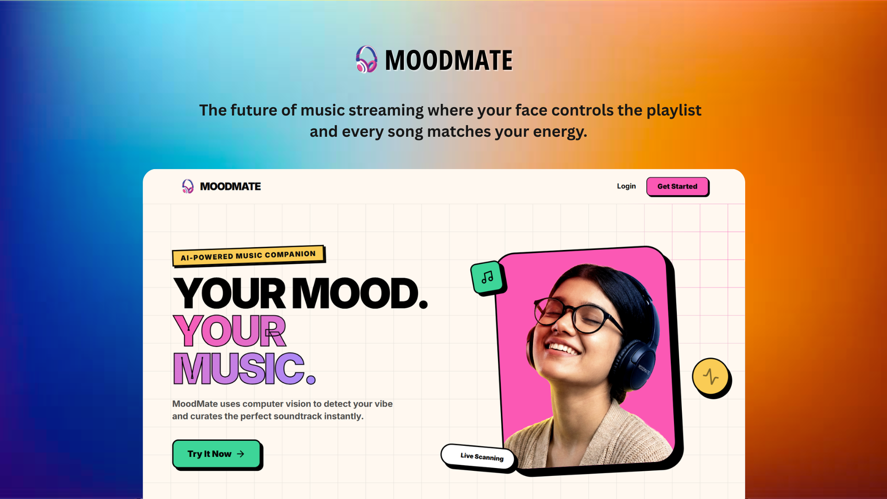

<div align="center">


[](https://twitter.com/intent/follow?screen_name=DeriaRanit)
[](https://www.linkedin.com/in/ranit-deria-916864257/)

  <br />
   <!-- Replace with your actual logo path if available, or remove -->
   <div align="center">
  
</div>
  <br />

  <h2 align="center">Mood Based Music Remommendation</h2>

  <p align="center">
  MoodMate is an intelligent emotional companion that detects your mood from a selfie, curates personalized music playlists, and connects you with a supportive community. Built with <strong>Next.js 16</strong>, <strong>React 19</strong>, and <strong>Supabase</strong>, and powered by a <strong>Flask AI Backend</strong>, it features a bold <strong>pop brutalist aesthetic</strong> and practical tools for your daily emotional well-being.
  </p>

  <a href="https://moodmate-seven.vercel.app/"><strong>➥ Live Demo</strong></a>

  <br />

  

</div>

## Table of Contents

- [Overview](#overview)
- [Prerequisites](#prerequisites)
- [Technologies Utilized](#technologies-utilized)
- [Features](#features)
- [Run Locally](#run-locally)
- [Deployment](#deployment)
- [Configuration](#configuration)
- [Project Structure](#project-structure)
- [Privacy & Safety](#privacy--safety)
- [License](#license)
- [Contact](#contact)

## Overview

Emotional wellbeing shouldn't be complicated or isolating. **MoodMate** elevates your daily mood with three core pillars:

- **Detection:** Instantly analyze your emotional state from a single selfie using advanced AI.
- **Curation:** Receive personalized music playlists tailored to resonate with or uplift your current vibe.
- **Connection:** Share your mood card with a supportive community to find others on the same wavelength.

All wrapped in a high-contrast, partially accessible, and mobile-responsive **Pop Brutalist UI**.

### Prerequisites: <a name="prerequisites"></a>

Before setting up MoodMate, ensure you have:

-  **Git** (Version control)
-  **Node.js** (v18.x or later)
-  **npm** or **pnpm** (Package manager)
-  **Python** (v3.9 or later)
-  **Supabase** (Account & Project)
-  **Docker** (Optional - for containerized backend)

### Technologies Utilized: <a name="technologies-utilized"></a>

- **Framework:**  Next.js 16 (App Router)
- **Language:**  TypeScript &  Python
- **Database & Auth:**  Supabase
- **AI Backend:**  Flask
- **Machine Learning:**  TensorFlow &  OpenCV
- **Data Processing:**  Pandas &  NumPy
- **Styling:**  Tailwind CSS
- **Deployment:**  Docker & Hugging Face Spaces
- **Icons:**  Lucide React

### Features: <a name="features"></a>

- **AI Mood Scanner:** Analyze your emotions from a selfie using computer vision.
- **Vibe Curation:** Get instant, mood-matched music recommendations.
- **Community Pulse:** Share your "vibe cards" and connect with others feeling similarly.
- **Secure Identity:** Seamless authentication via Supabase.
- **Pop Brutalist Design:** A bold, high-contrast interface for a unique user experience.
- **Emotional Safety:** Crisis resource integration for detected distress signals.
- **Responsive & Fluid:** Optimized for all devices with smooth animations.

### Run Locally: <a name="run-locally"></a>

1. **Clone the Repository:**

   ```bash
   git clone https://github.com/RanitDERIA/moodmate.git
   cd moodmate
   ```

2. **Backend Setup:**

   Open a terminal and navigate to the backend directory:

   ```bash
   cd backend
   pip install -r requirements.txt
   python app.py
   ```
   
   The Flask server will start on `http://localhost:5000`.

3. **Frontend Setup:**

   Open a new terminal in the project root:

   ```bash
   npm install
   # or
   pnpm install
   ```

4. **Environment Configuration:**

   Create a `.env.local` file in the root directory:

   ```env
   NEXT_PUBLIC_SUPABASE_URL=your_supabase_url
   NEXT_PUBLIC_SUPABASE_ANON_KEY=your_supabase_anon_key
   ```

5. **Start Application:**

   ```bash
   npm run dev
   ```

   Visit `http://localhost:3000` to begin your journey.

### Deployment: <a name="deployment"></a>

MoodMate follows a distributed deployment strategy:

1. **Frontend:** Deployed on **Vercel** for optimal performance and edge capabilities.
2. **Backend:** AI Service hosted on **Hugging Face Spaces** (Docker/Flask).

To deploy your own instance:
1. Fork the repo.
2. Deploy the `backend` folder to Hugging Face Spaces (choose Docker SDK).
3. Import the repo to Vercel and configure the environment variables.

### Configuration: <a name="configuration"></a>

- **Environment Variables:**
  - `NEXT_PUBLIC_SUPABASE_URL`: Your Supabase Project URL.
  - `NEXT_PUBLIC_SUPABASE_ANON_KEY`: Your Supabase Anonymous Key.
  - `NEXT_PUBLIC_API_URL`: URL of your deployed Flask Backend.

- **Theme & Branding:**
  - The "Pop Brutalist" aesthetic is centrally managed in `tailwind.config.js`.
  - Primary colors and shadows can be adjusted to match your preferred vibe.

### Project Structure: <a name="project-structure"></a>

```
moodmate/
├── .gitignore
├── app/
│   ├── about/
│   │   └── page.tsx
│   ├── api/
│   │   ├── analyze-text/
│   │   │   └── route.ts
│   │   └── metadata/
│   │       └── route.ts
│   ├── auth/
│   │   └── callback/
│   │       └── route.ts
│   ├── community/
│   │   ├── [id]/
│   │   │   ├── opengraph-image.tsx
│   │   │   ├── page.tsx
│   │   │   └── vibe-details-client.tsx
│   │   └── page.tsx
│   ├── contact/
│   │   └── page.tsx
│   ├── cookie-policy/
│   │   └── page.tsx
│   ├── forgot-password/
│   │   └── page.tsx
│   ├── globals.css
│   ├── home/
│   │   └── page.tsx
│   ├── icon.png
│   ├── landing/
│   │   └── page.tsx
│   ├── layout.tsx
│   ├── login/
│   │   └── page.tsx
│   ├── my-vibe/
│   │   └── page.tsx
│   ├── not-found.tsx
│   ├── page.tsx
│   ├── privacy-policy/
│   │   └── page.tsx
│   ├── profile/
│   │   └── page.tsx
│   ├── reset-password/
│   │   └── page.tsx
│   ├── signup/
│   │   └── page.tsx
│   ├── terms/
│   │   └── page.tsx
│   └── vibes/
│       └── page.tsx
├── backend/
│   ├── app.py
│   ├── data/
│   │   └── processed_music.csv
│   ├── Dockerfile
│   ├── models/
│   │   └── moodmate_final_model.h5
│   └── requirements.txt
├── components/
│   ├── community/
│   │   ├── comment-section.tsx
│   │   ├── search-filter-bar.tsx
│   │   ├── share-modal.tsx
│   │   ├── social-share-modal.tsx
│   │   ├── vibe-badge.tsx
│   │   ├── vibe-card.tsx
│   │   ├── vibe-detailed-card.tsx
│   │   └── vibe-details-modal.tsx
│   ├── custom/
│   │   ├── architecture-diagram.tsx
│   │   ├── home-button.tsx
│   │   ├── interactive-grid.tsx
│   │   ├── mood-card.tsx
│   │   ├── not-found-content.tsx
│   │   ├── oauth-button.tsx
│   │   ├── otp-input.tsx
│   │   ├── song-grid.tsx
│   │   └── webcam-view.tsx
│   ├── dashboard/
│   │   └── dashboard-header.tsx
│   ├── home/
│   │   ├── greeting-header.tsx
│   │   ├── history-list.tsx
│   │   ├── instructions.tsx
│   │   ├── mood-selector.tsx
│   │   ├── stats-card.tsx
│   │   └── trending-section.tsx
│   ├── layout/
│   │   ├── footer.tsx
│   │   ├── navbar.tsx
│   │   └── user-nav.tsx
│   ├── ui/
│   │   ├── confirm-modal.tsx
│   │   └── tabs.tsx
│   ├── VibeAnalytics.tsx
│   └── VibeDashboard.tsx
├── components.json
├── eslint.config.mjs
├── lib/
│   ├── api.ts
│   ├── moods.ts
│   ├── supabase.ts
│   ├── utils.ts
│   └── validators.ts
├── middleware.ts
├── next.config.ts
├── package-lock.json
├── package.json
├── postcss.config.mjs
├── public/
│   ├── file.svg
│   ├── globe.svg
│   ├── images/
│   │   ├── amazon.png
│   │   ├── apple.png
│   │   ├── Chill.png
│   │   ├── Energetic.png
│   │   ├── flask.png
│   │   ├── Focus1.png
│   │   ├── gaana.png
│   │   ├── Happy.png
│   │   ├── infosys.png
│   │   ├── land.png
│   │   ├── logo.png
│   │   ├── numpy.png
│   │   ├── pandas.png
│   │   ├── saavn.png
│   │   ├── Sad.png
│   │   ├── Sleep.png
│   │   ├── soundcloud.png
│   │   ├── spotify.png
│   │   ├── tensorflow.png
│   │   └── ytmusic.png
│   ├── next.svg
│   ├── thumbnails/
│   │   ├── ama1.png
│   │   ├── ama2.png
│   │   ├── ama3.png
│   │   ├── ama4.png
│   │   ├── cloud1.png
│   │   ├── cloud2.png
│   │   ├── spot1.png
│   │   ├── spot2.png
│   │   ├── spot3.png
│   │   ├── spot4.png
│   │   └── spot5.png
│   ├── vercel.svg
│   └── window.svg
├── README.md
├── supabase/
│   └── migrations/
│       ├── 20251230_add_comments_column.sql
│       ├── 20251230_add_likes_column.sql
│       ├── 20251230_add_tagline_to_community_playlists.sql
│       ├── 20251230_backfill_profiles.sql
│       ├── 20251230_comment_features.sql
│       ├── 20251230_community_playlists.sql
│       ├── 20251230_create_comments_table.sql
│       ├── 20251230_fix_comments_fk.sql
│       ├── 20251230_fix_profiles_schema.sql
│       ├── 20251230_likes_table.sql
│       ├── 20251230_social_features.sql
│       ├── 20260101_add_update_policy.sql
│       ├── fix_likes_logic.sql
│       └── fix_likes_rls.sql
├── tsconfig.json
├── types/
│   └── index.ts
└── utils/
    └── supabase/
        ├── client.ts
        ├── middleware.ts
        └── server.ts

```

### Privacy & Safety: <a name="privacy--safety"></a>

- **Ephemeral Processing:** User photos are processed in-memory for mood detection and immediately discarded. No images are ever stored on our servers.
- **Data Security:** Personal data and curated vibes are secured via Supabase's Row Level Security (RLS) policies.
- **Emotional Well-being:** If signs of distress are detected, MoodMate automatically provides links to verified crisis hotlines and mental health resources.

### License: <a name="license"></a>

This project is licensed under the **Apache License 2.0**.
<sub>

- Free to use, modify, and distribute (including commercial use)  
- Redistributions must include proper attribution and the license copy  
- Modified files must clearly indicate changes  
- Provided **AS IS**, without warranties or liability  
</sub>

### Acknowledgements: <a name="acknowledgements"></a>

I would like to express my sincere gratitude to my mentor, for their invaluable guidance, continuous support, and constructive feedback throughout the development of **MoodMate**. Their insights played a pivotal role in refining the machine learning pipeline and shaping the final architecture of this project.

I also extend my thanks to **Infosys Springboard** for providing the platform, resources, and internship opportunity that allowed me to explore advanced AI/ML concepts and apply them in a real-world scenario.

<p align="center">
  
  <br>
  <i>Virtual Internship 6.0</i>
</p>

### Let's Connect

<p align="left">
  <a href="mailto:bytebardderia@gmail.com">
    
  </a>
  <a href="https://www.linkedin.com/in/ranit-deria-916864257/">
    
  </a>
  <a href="https://twitter.com/DeriaRanit">
    
  </a>
  <a href="https://github.com/RanitDERIA">
    
  </a>
</p>

---
<div align="center">

**⭐ Star this repository if you enjoyed your vibe check!**

Made with ❤️ and 🎵 by [Ranit Deria](https://profession-folio.vercel.app)

</div>
